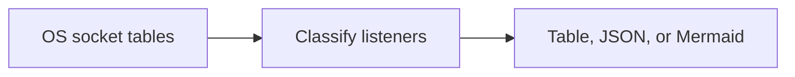

<!-- readme-refresh:start -->
<p align="center">
  <picture>
    <source media="(prefers-color-scheme: dark)" srcset="assets/readme-banner.png">
    <source media="(prefers-color-scheme: light)" srcset="assets/readme-banner.png">
    
  </picture>
</p>

<h1 align="center">🔌 PortWhisper</h1>

<p align="center"><strong>Inspect listening ports with clear exposure labels and portable output.</strong></p>

<p align="center">
  <a href="https://github.com/al1re3a/portwhisper/actions/workflows/ci.yml"></a>
  <a href="https://www.rust-lang.org/"></a>
  <a href="LICENSE"></a>
  <a href="https://github.com/al1re3a/portwhisper/stargazers"></a>
  <a href="https://github.com/al1re3a/portwhisper/issues"></a>
</p>

<p align="center">
  <a href="https://github.com/al1re3a/portwhisper"></a>
  <a href="#install-and-develop"></a>
  <a href="CONTRIBUTING.md"></a>
  <a href="SECURITY.md"></a>
</p>

<p align="center">
  
</p>

> [!NOTE]
> Exposure labels describe bind addresses. Firewall policy and network reachability still need separate verification.

## 📑 Contents

- [At a glance](#-at-a-glance)
- [Exposure labels](#exposure-labels)
- [Install and develop](#install-and-develop)

---

## 🔎 At a glance

| | |
|---|---|
| **Purpose** | Cross-platform listening-port inspector with exposure labels, JSON and Mermaid output. Rust, no dependencies. |
| **Input** | OS socket tables |
| **Output** | Table, JSON, or Mermaid |
| **Runtime** | Rust 2021 edition |
| **CI** | ✅ Linux · macOS · Windows |
| **Status** | ✅ Maintained |

<details>
<summary><strong>🧭 How it works</strong></summary>



</details>

<details>
<summary><strong>📁 Repository layout</strong></summary>

```text
portwhisper/
├── .github/
├── src/
├── examples/
├── Cargo.toml
└── README.md
```

</details>

<details>
<summary><strong>🤝 Contributors</strong></summary>

<br>
<a href="https://github.com/al1re3a/portwhisper/graphs/contributors">
  
</a>

</details>
<!-- readme-refresh:end -->

Explain which TCP ports are listening, which process owns them when the operating system reports it, and whether they are bound locally or exposed to a network.

```console
portwhisper
portwhisper --format json
portwhisper --format mermaid > ports.mmd
```

PortWhisper uses built-in operating-system tools: `netstat` on Windows, `ss` on Linux, and `lsof` on macOS. No packets are sent and no ports are opened. Process details may require the same privileges as the owning process.

It can also parse captured output, which is useful for support tickets and CI fixtures:

```console
portwhisper --input examples/windows-netstat.txt --source windows
```

## Exposure labels

- `local`: loopback only, normally reachable just from this host.
- `network`: bound to one non-loopback address.
- `all-interfaces`: wildcard binding; review firewall and application authentication.

An exposure label is not proof that a port is reachable through a firewall.

## Install and develop

```console
cargo install --path .
cargo fmt --check
cargo clippy --all-targets -- -D warnings
cargo test --all-targets
```

MIT licensed. Contributions are welcome.
